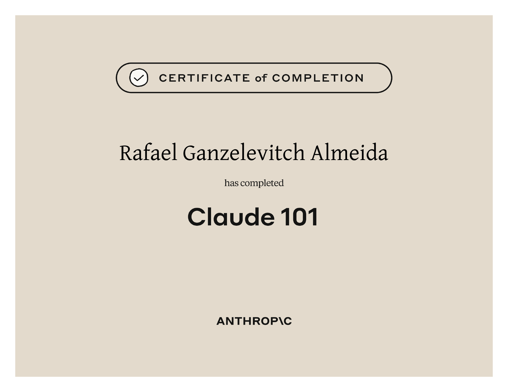

# Certificates

Copyright (c) 2026 Rafael Ganzelevitch Almeida

All Rights Reserved.

The contents of this repository, including but not limited to all
certificates, documents, images, and files contained herein, are the
personal property of Rafael Ganzelevitch Almeida and are provided for
personal, informational, and verification purposes only.

No part of this repository may be copied, reproduced, distributed,
transmitted, modified, republished, downloaded, posted, or used in any
form or by any means — electronic, mechanical, or otherwise — without
the prior written permission of the copyright holder.

No license, express or implied, is granted to any third party to use,
reuse, or claim ownership of any content in this repository for any
purpose, commercial or non-commercial.

Unauthorized use, reproduction, or distribution of this material may
result in legal action.

| Curso | Instituição | Data | Link |
|---|---|---|---|
| Claude 101 | Anthropic | 2026 |  |
